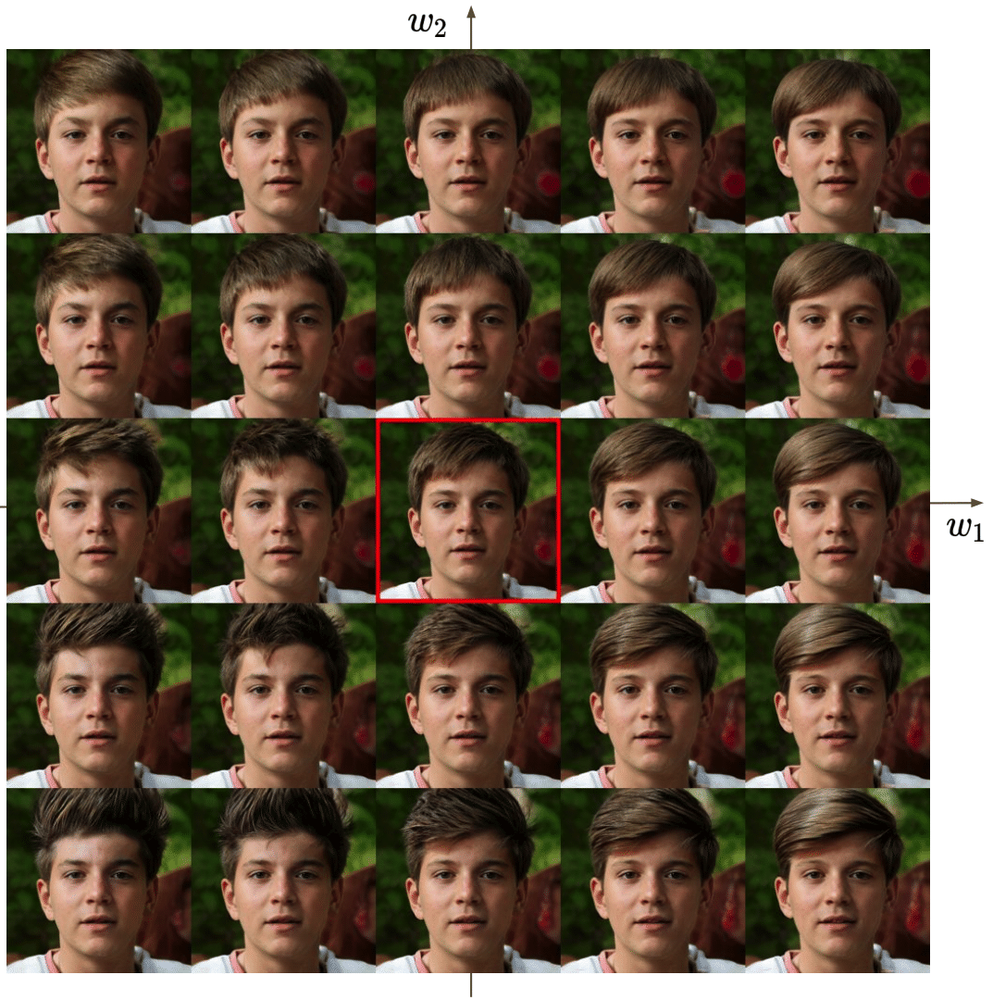

# LELSD


**Optimizing Latent Space Directions For GAN-based Local Image Editing**<br>
Ehsan Pajouheshgar, Tong Zhang, and Sabine Süsstrunk<br>
You can find our paper on [arxiv](https://arxiv.org/pdf/2111.12583.pdf).

Abstract: *Generative Adversarial Network (GAN) based localized image editing can suffer ambiguity between semantic
attributes. We thus present a novel objective function to evaluate the locality of an image edit. By introducing the
supervision from a pre-trained segmentation network and optimizing the objective function, our framework, called Locally
Effective Latent Space Direction (LELSD), is applicable to any dataset and GAN architecture. Our method is also
computationally fast and exhibits a high extent of disentanglement, which allows users to interactively perform a
sequence of edits on an image. Our experiments on both GAN-generated and real images qualitatively demonstrate the high
quality and advantages of our method.*

## Release notes

- Now we support all StyleGAN models including Alias-Free GAN (StyleGAN3).
- We also support BigGAN model.
- To find more information on how to get the pretrained segmentation, and GAN models, check out the *pretrained/*
  directory
- We support using few-shot pretrained segmentation models introduced in the paper **Linear Semantics in Generative
  Adversarial Networks**

## Requirements

Our requirements are very similar to the requirements from StyleGAN3 repo.

* Linux and Windows are supported, but we recommend Linux for performance and compatibility reasons.
* 1&ndash;8 high-end NVIDIA GPUs with at least 12 GB of memory.
* 64-bit Python 3.8 and PyTorch 1.9.0 (or later). See https://pytorch.org for PyTorch install instructions.
* CUDA toolkit 11.1 or later.
* GCC 7 or later (Linux) or Visual Studio (Windows) compilers. Recommended GCC version depends on CUDA version, see for
  example [CUDA 11.4 system requirements](https://docs.nvidia.com/cuda/archive/11.4.1/cuda-installation-guide-linux/index.html#system-requirements)
  .
* Python libraries: see [environment.yml](./environment.yml) for exact library dependencies. You can use the following
  commands with Miniconda3 to create and activate your LELSD Python environment:
    - `conda env create -f environment.yml`
    - `conda activate stylegan3`
* Docker users:
    - Ensure you have correctly installed
      the [NVIDIA container runtime](https://docs.docker.com/config/containers/resource_constraints/#gpu).
    - Use the [provided Dockerfile](./Dockerfile) to build an image with the required library dependencies.

## Getting started

Follow the guides in the *pretrained/* directory to download the models that you want. You can also use your own
pretrained segmentation and GAN models.

### Jupyter Notebooks

In the notebooks folder you can find a sample jupyter notebook for training LELSD model on StyleGAN2 models pretrained
on FFHQ, MetFaces, LSUN Church, LSUN Car, and LSUN Horse dataset. Based on this, you create your own notebook to train
LELSD on your own pretrained GAN.

### Streamlit apps

We provide three simple apps that you can use to generate figures similar to the ones that we present in the paper. The
apps are easy to use. You can choose the GAN model and the dataset, then it will scan the folder you use to store the
trained LELSD models and find the last model for each semantic.

<hr>

```
streamlit run 2D_visualization.py
```

Using this app you can combine two directions found by the model for editing the same semantic and create a palette of
edit like figure bellow. Based on this palette you can choose the edit strengths that will yield your desired edit. Note
that you need to have a LELSD trained model with *num_latent_dirs=2* to use this app.



<hr>

```
streamlit run sequential_editing.py
```

Using this app you can stack sequences of edits to generate a figure like this. Note that in this figure we're editing
real photographs and use [e4e](https://github.com/omertov/encoder4editing) for GAN inversion.


<hr>

```
streamlit run model_comparison.py
```

Using this app you compare different models with each other. We allow comparing

- LELSD models trained with different configs
- Random directions in the latent space
- Directions found in the [StyleSpace Analysis](https://github.com/betterze/StyleSpace) paper

You can check the equally spaced LPIPS button to generate a figure similar to the one we've used in the paper.


## Acknowledgement

We borrow a lot from these repositories:

**StyleGAN2-ADA — Official PyTorch implementation**

```
https://github.com/NVlabs/stylegan2-ada-pytorch
```

**Alias-Free Generative Adversarial Networks (StyleGAN3)**

```
https://github.com/NVlabs/stylegan3
```

**DeepLab with PyTorch**

```
https://github.com/kazuto1011/deeplab-pytorch
```

**face-parsing.PyTorch**

```
https://github.com/zllrunning/face-parsing.PyTorch
```

**Linear Semantics in Generative Adversarial Networks**

```
https://github.com/AtlantixJJ/LinearGAN
```

**PyTorch pretrained BigGAN**

```
https://github.com/huggingface/pytorch-pretrained-BigGAN
```

**Localized Semantic Editing of StyleGAN outputs**

```
https://github.com/IVRL/GANLocalEditing
```